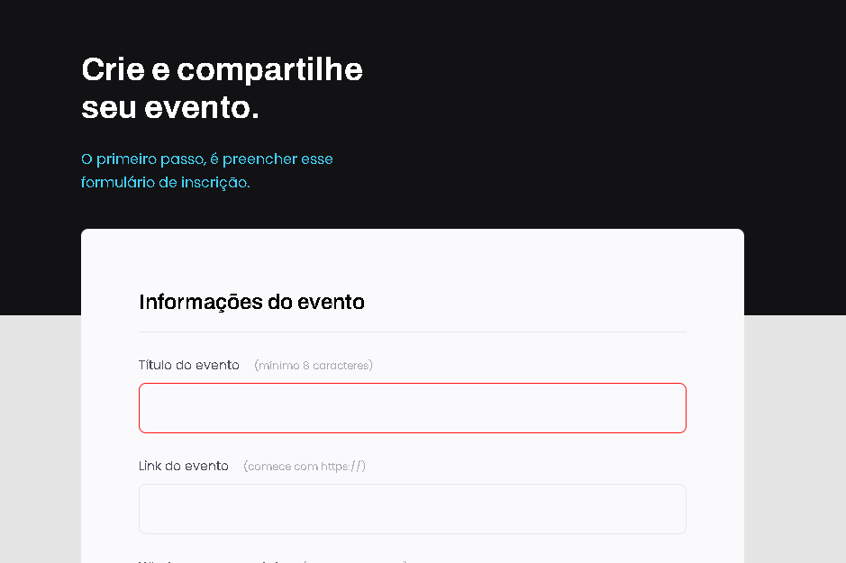

  

  <h1 align="center"> Explorer Stage 03 - Formulários 📝</h1>

  

  <a href="#-tecnologias">Tecnologias</a>&nbsp;&nbsp;&nbsp;|&nbsp;&nbsp;&nbsp;
  <a href="#-projeto">Projeto</a>&nbsp;&nbsp;&nbsp;|&nbsp;&nbsp;&nbsp;
  <a href="#-layout">Layout</a>&nbsp;&nbsp;&nbsp;|&nbsp;&nbsp;&nbsp;
  <a href="#memo-licença">Licença</a>

 

  

## 💻 Projeto 03
Esse projeto simples consiste na criação de um formulário que simula o preenchimento de dados para um evento. 📆

## 🚀 Tecnologias

- HTML5
- CSS3
- Git e Github
- Vercel

## 🔖 Layout

Você pode visualizar o layout do projeto através [DESSE LINK](). 
## :memo: Licença

Esse projeto está sob a licença MIT.

